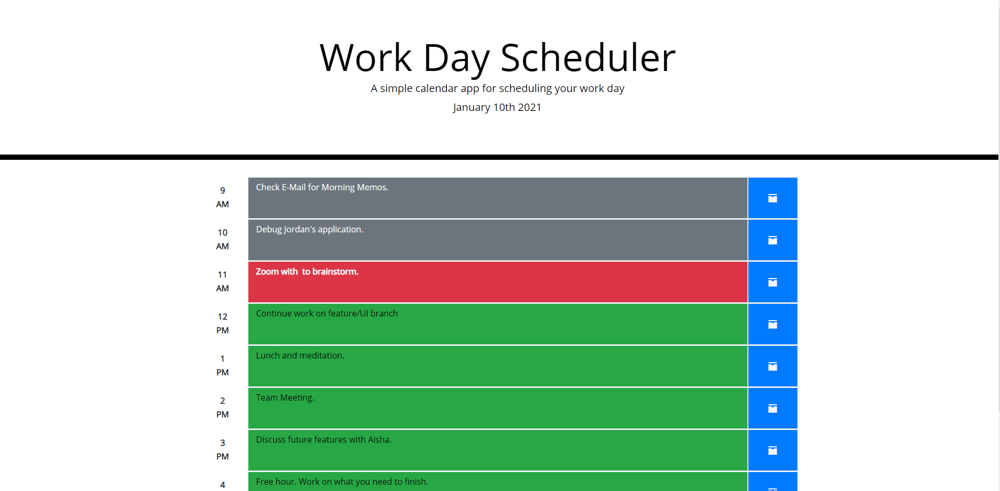
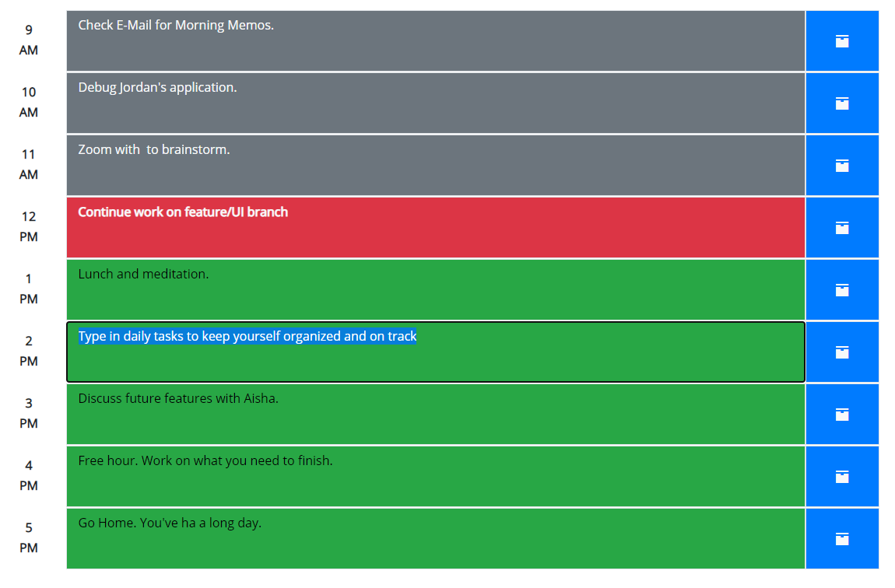

# Work Day Scheduler
## Description
This application provides a Javascript-powered task manager for the average 9 to 5 workday.
Each hour of the day can be edited to remind workers of the tasks they have due throughout the day to better manage their time.
As the day progresses the tasks will change color by to denote which tasks are imminent, past due, and still to come.
## Built With
* HTML
* CSS
* JavaScript
* JQuery
* Moment.js
* Bootstrap
* Iconic
## Website
https://jpkashlak.github.io/workday-scheduler/
## Preview

